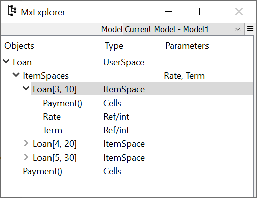

An actuarial modeling system has to deliver four things at once:
**transparency**, **auditability**, **performance** and
**maintainability**. modelx approaches all four with a single principle:
actuarial models are code &mdash; plain, readable Python.

<div class="row">
  <div class="col-sm-4">
    <h3 id="coming-from-excel">Coming from Excel</h3>
    <ul>
      <li><a href="#dependency-tracing">Trace any result to its inputs</a></li>
      <li><a href="#version-control">Git diffs, not workbook copies</a></li>
      <li><a href="#excel-interface">Excel stays your data interface</a></li>
    </ul>
  </div>
  <div class="col-sm-4">
    <h3 id="coming-from-plain-python">Coming from plain Python</h3>
    <ul>
      <li><a href="#no-programming">No orchestration code to write</a></li>
      <li><a href="#object-oriented">Structure: spaces, inheritance, parameters</a></li>
      <li><a href="#document-integration">Models double as documentation</a></li>
    </ul>
  </div>
  <div class="col-sm-4">
    <h3 id="coming-from-commercial-modeling-systems">Coming from commercial systems</h3>
    <ul>
      <li>Every formula inspectable, no license cost (LGPLv3)</li>
      <li><a href="ai.html">Open Python ecosystem and AI agents</a></li>
      <li><a href="#export-to-pure-python">No lock-in&mdash;not even to modelx</a></li>
    </ul>
  </div>
</div>


## Deployment & performance

Build in modelx; ship plain Python; compile it native when you need speed.
No step requires a proprietary runtime.

<pre><code class="language-mermaid">
graph LR
A(Build in modelx) --> B("model.export()")
B --> C(Pure-Python package<br>runs without modelx)
C --> D(mx2cy)
D --> E(Native-compiled model)
</code></pre>

### Export to pure Python

Since modelx 0.22.0, [`Model.export`] turns any model into a
self-contained Python package&mdash;plain code with no runtime dependency
on modelx, deployable wherever Python runs:

```py
>>> model.export("TermLife_ex")

>>> from TermLife_ex import mx_model    # no modelx needed

>>> mx_model.Projection.net_cf(10)
11.725013975627874
```

Some features are not supported in exported models&mdash;see
[`Model.export`] for current limitations and
[Introducing the Export Feature]()
for background.

[`Model.export`]: https://docs.modelx.io/en/latest/reference/generated/modelx.core.model.Model.export.html

### Native compilation with modelx-cython

[modelx-cython] translates exported models to [Cython] and compiles them
to native code with a single command:

```console
$ mx2cy TermLife_ex
```

modelx-cython is at an early, experimental stage&mdash;see the
[modelx-cython] repository for status, and
[Introducing modelx-cython]()
for background and measurements.

[modelx-cython]: https://github.com/fumitoh/modelx-cython
[Cython]: https://cython.org/


## Modeling in a GUI

### GUI as Spyder plugin

[spyder-modelx](https://docs.modelx.io/en/latest/spyder.html) embeds
modelx in [Spyder](https://www.spyder-ide.org/), the open-source Python
IDE: *MxExplorer* shows the model as a tree with each cell's formula a
click away, *MxDataViewer* inspects results as DataFrames, and the
precedents/dependents pane traces values interactively.

<a href="/img/MxPluginImage.png">
  
</a>

<!-- TODO(fumito): fresh MxExplorer / MxDataViewer screenshots at the current spyder-modelx version -->

Watch the [demo video](https://www.youtube.com/watch?v=rHPuXmZd0TY) to
see it in action.


## Governance & auditability

### Dependency tracing

Every calculated value knows its precedents and dependents, so you can
trace an entire projection from result to assumptions:

```py
>>> Balance.preds(5)
[Model1.Space1.Balance(t=4)=400, Model1.Space1.Cashflow(t=5)=100]

>>> Balance.succs(4)
[Model1.Space1.Balance(t=5)=500]
```

<div class="row">
  <div class="col-sm-6">
    
  </div>
  <div class="col-sm-6">
    
  </div>
</div>

### Version control

Models are saved as plain Python text, so [Git] gives you meaningful
diffs, history, branches and code review. Plain text is also what AI
coding agents read&mdash;see [modelx and AI agents](ai.html).

[Git]: https://git-scm.com/

### Document integration

Docstrings written on models, spaces and cells render into full model
documentation with [Sphinx]&mdash;HTML, PDF and other formats, with math,
images and code samples. See [lifelib] for samples.

[Sphinx]: https://www.sphinx-doc.org/en/master/
[lifelib]: https://lifelib.io


## Model design & productivity

### Automatic calculation order {#no-programming}

Define formulas like you do on spreadsheets; modelx resolves the
calculation order from their dependencies and caches results until they
need recalculating. No run scripts to write:

```py
>>> import modelx as mx

>>> @mx.defcells
... def Cashflow(t):
...     return 100

>>> @mx.defcells
... def Balance(t):
...     if t > 0:
...         return Balance(t-1) + Cashflow(t)
...     else:
...         return 0
    
>>> Balance(5)
500
```

### Readable formulas

Formulas are ordinary
[Python functions](https://docs.python.org/3/tutorial/controlflow.html#defining-functions)&mdash;far
more readable than spreadsheet formulas, with Python's control flow,
data structures and
[lambda expressions](https://docs.python.org/3/tutorial/controlflow.html#lambda-expressions)
available.

### Object-oriented

You build models from objects&mdash;**Models**, **Spaces** and
**Cells**&mdash;with [composition] and [inheritance] as in
object-oriented programming:

<pre><code class="language-mermaid">
graph TD
A(Model1) --- B[Space1]
B --- C[Cells1]
B --- D[Space2]
D --- E(Cells2)
</code></pre>

[composition]: https://en.wikipedia.org/wiki/Object_composition
[inheritance]: https://en.wikipedia.org/wiki/Inheritance_(object-oriented_programming)

### Parameterization

Write a space once, then apply it to arbitrary combinations of inputs
without changing formula signatures:

```py
>>> space.parameters = ("Rate", "Term")

>>> space[3, 10].Payment()
117.23050660515952
```



### Excel Interface

Excel files are great for storing data of relatively small sizes.
You can create new spaces and populate new cells in the space with data
from Excel files.


## Get started

```
pip install modelx
# or
conda install -c conda-forge modelx
```

Then follow the
[tutorial](https://docs.modelx.io/en/latest/tutorial/index.html), or
explore working actuarial models at [lifelib](https://lifelib.io).
